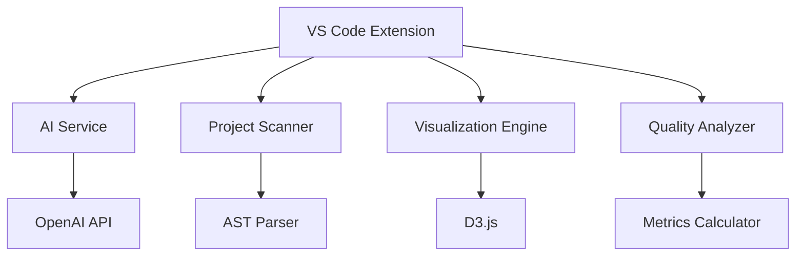

# IndiCab Spring Analyzer Extension Documentation

## Technical Architecture



## Core Features

### AI-Powered Analysis
- **GPT-4 Turbo Integration**: Advanced code understanding and suggestions
- **Context-Aware Prompts**: Project-specific recommendations
- **Multi-Modal Analysis**: Code, documentation and test generation

### Visualization System
- **Interactive Graphs**: Force-directed component diagrams
- **Real-Time Updates**: Live project structure visualization
- **Custom Layouts**: Hierarchical, circular and compact views

### Quality Intelligence
- **Comprehensive Metrics**: 50+ code quality indicators
- **Technical Debt Analysis**: Time/cost estimates for improvements
- **Trend Visualization**: Historical quality tracking

## Configuration

### AI Settings
```json
{
  "indicabAI": {
    "apiKey": "your_openai_key",
    "model": "gpt-4-turbo",
    "temperature": 0.7,
    "maxTokens": 2000
  }
}
```

### Quality Thresholds
```json
{
  "indicab.quality": {
    "complexity": 15,
    "cohesion": 0.8, 
    "coupling": 5,
    "security": 0
  }
}
```

### Visualization Settings
```json
{
  "indicab.visualization": {
    "theme": "dark|light|system",
    "layout": "force|hierarchical|circular",
    "animation": true,
    "depth": 3
  }
}
```

## Development Guide

### Building
```bash
npm install
npm run compile
npm run package
```

### Testing
```bash
npm test
```

### Debugging
1. Open extension in VS Code
2. Set breakpoints in source code
3. Press F5 to launch debug session

## Support
- [Documentation](https://indicab.dev/docs)
- [Issue Tracker](https://github.com/indicab/vscode-extension/issues)
- [Community Forum](https://github.com/indicab/vscode-extension/discussions)
