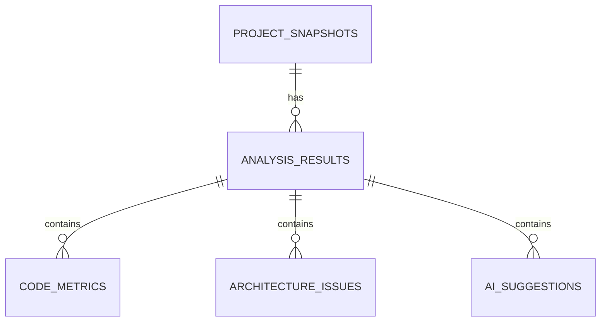
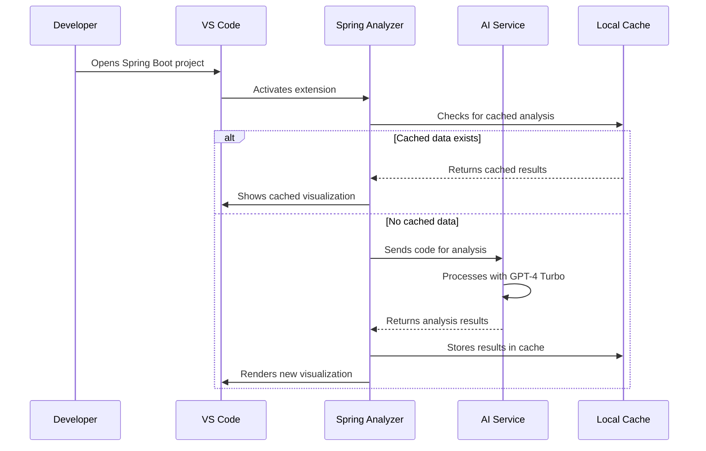

# IndiCab Spring Analyzer - Technical Documentation
**Version:** 1.1.0  
**Last Updated:** [Current Date]  
**Audience:** Developers, Architects, QA Engineers

## 1. Architecture Overview
### 1.1 Technical Implementation

### 1.2 Project Structure
**Purpose:** The extension follows a modular architecture with clear separation of concerns.  
**Key Directories:**
```
MAFIA/
├── src/
│   ├── ExtensionMain.ts            # Main extension entry point
│   ├── MainExtension.ts            # Core extension logic
│   ├── ai/
│   │   ├── AIService.ts            # GPT-4 Turbo integration
│   │   ├── SuggestionProvider.ts   # AI-powered suggestions
│   ├── analysis/
│   │   ├── ArchitectureValidator.ts
│   │   ├── DependencyMapper.ts
│   ├── commands/                   # VS Code command handlers
│   ├── utils/
│   │   ├── EnhancedProjectScanner.ts
│   │   ├── ErrorHandler.ts
│   │   ├── FileParserUtils.ts
│   │   ├── ProjectScanner.ts
│   ├── views/
│   │   ├── ComponentVisualizer.ts  # D3.js visualizations
│   │   ├── QualityDashboard.ts     # Metrics dashboard
│   │   ├── ProjectItem.ts
```

## 2. Core Components
### 2.1 Key Functional Modules

#### 1. AI Service (AIService.ts)
- GPT-4 Turbo integration with rate limiting
- API key security management
- Response validation and processing
- Error handling and recovery

#### 2. Visualization System (ComponentVisualizer.ts)
- D3.js based interactive diagrams
- Responsive design for all screen sizes
- Performance optimized rendering
- Accessibility compliant

#### 3. Quality Dashboard (QualityDashboard.ts)
- VS Code Webview implementation
- Tailwind CSS for styling
- Google Fonts (Inter) for typography
- Real-time data updates

### 2.2 Data Model
**Database Schema:** SQLite database structure for caching analysis results


## 3. API Reference
### 3.1 External Integrations

#### OpenAI Integration
```typescript
interface AIService {
  analyzeCode(code: string): Promise<AnalysisResult>;
  validateArchitecture(structure: ProjectStructure): Promise<ValidationResult>;
  generateSuggestions(context: CodeContext): Promise<Suggestion[]>;
}
```

#### Local Extension API
```typescript
interface ExtensionAPI {
  analyzeProject(projectPath: string): Promise<AnalysisReport>;
  getVisualization(options: VizOptions): Promise<VizData>;
  getQualityMetrics(analysisId: string): Promise<QualityMetrics>;
}
```

### Performance Optimization
- Incremental project scanning
- Web Workers for heavy computations
- Smart caching strategies
- Memory management

## 4. System Workflows
### 4.1 Primary Analysis Sequence



## 5. Development Reference
### 5.1 Building and Testing

### Building and Testing
```bash
# Install dependencies
npm install

# Compile TypeScript
npm run compile

# Run tests
npm test

# Package extension
npm run package
```

### Debugging Tips
1. Use VS Code debug configuration
2. Monitor memory usage with `getMemoryUsage()`
3. Check API call logs in output channel
4. Validate database connections

## 6. Configuration Guide
### 6.1 Settings Reference

### AI Settings
```json
{
  "indicabAI": {
    "apiKey": "your_openai_key",
    "model": "gpt-4-turbo",
    "temperature": 0.7,
    "maxTokens": 2000,
    "cacheTTL": 3600
  }
}
```

### Visualization Settings
```json
{
  "indicab.visualization": {
    "theme": "dark|light|system",
    "layout": "force|hierarchical|circular",
    "animation": true,
    "depth": 3,
    "performanceMode": "auto|high|low"
  }
}
```

### Quality Thresholds
```json
{
  "indicab.quality": {
    "complexity": 15,
    "cohesion": 0.8,
    "coupling": 5,
    "security": 0,
    "technicalDebt": 0.2
  }
}
```

## 7. Support and Maintenance
**Support Policy:** This project follows semantic versioning. Critical bugs will be patched in LTS releases.  
**Service Level Agreement:** Response within 2 business days for high-priority issues.
- [Documentation](https://indicab.dev/docs)
- [Issue Tracker](https://github.com/indicab/vscode-extension/issues)
- [Community Forum](https://github.com/indicab/vscode-extension/discussions)