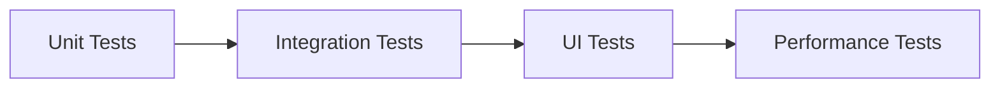

# MAFIA VS Code Extension Improvement Plan

## Proposed Architecture Enhancements

### 1. AI Service Improvements
- **Caching Layer**: 
  - Implement LRU cache with TTL (Time To Live)
  - Cache size: 100MB by default (configurable)
  - Automatic invalidation on code changes

- **Error Handling**:
  ```typescript
  // Example enhanced error handling
  try {
    await getSuggestions();
  } catch (error) {
    ErrorHandler.categorize(error);
    if (error.isRetryable) {
      await exponentialBackoff(retry);
    }
  }
  ```

### 2. Real-Time Analysis Engine
| Component | Responsibility | Tech Stack |
|-----------|----------------|------------|
| ArchitectureValidator | Code quality scoring | TypeScript, ANTLR |
| DependencyMapper | Project visualization | D3.js, GraphQL |

### 3. UI Modernization
**Tailwind CSS Integration:**
```html
<div class="bg-gray-100 p-4 rounded-lg shadow-md">
  <h2 class="text-xl font-semibold text-blue-600">Quality Dashboard</h2>
  <div class="mt-2 space-y-2">
    <!-- Dashboard content -->
  </div>
</div>
```

## Implementation Phases

### Phase 1: Core Infrastructure (2 weeks)
1. [ ] Error handling system
2. [ ] Caching mechanism
3. [ ] Tailwind CSS setup

### Phase 2: Feature Implementation (3 weeks)
1. [ ] Real-time validation
2. [ ] Dependency visualization
3. [ ] Quality dashboard

### Phase 3: Polish & Optimization (1 week)
1. [ ] Performance tuning
2. [ ] Accessibility audit
3. [ ] Documentation updates

## Migration Guide
Existing users should:
1. Update their API key configuration
2. Review new architecture validation rules
3. Familiarize with new dashboard layout

## Testing Strategy


## Performance Benchmarks
| Operation | v1.1 (ms) | Target (ms) |
|-----------|----------|------------|
| Suggestion | 1200 | 800 |
| Validation | 2500 | 1500 |
| Graph Render | 3500 | 2000 |