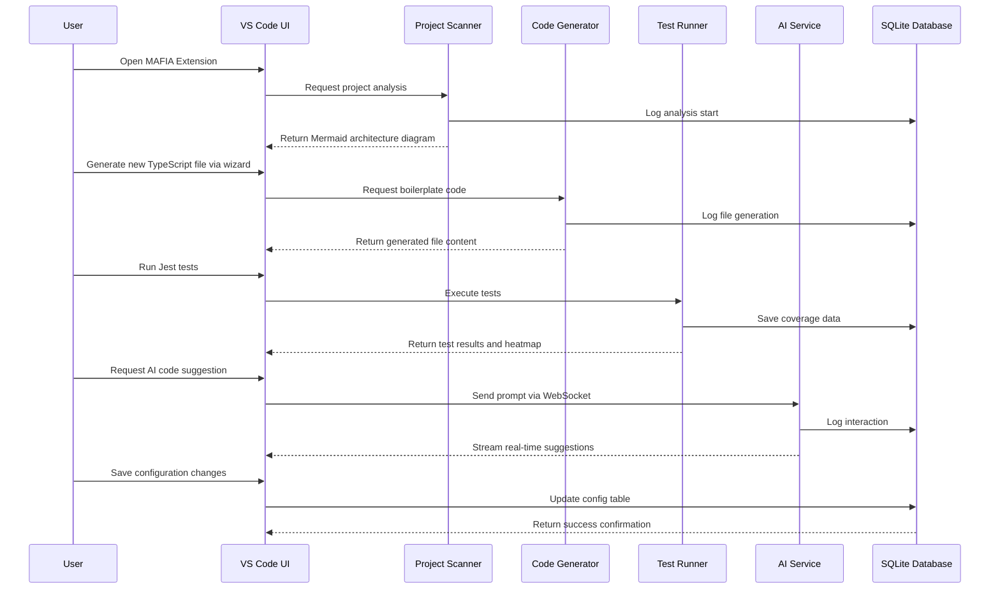
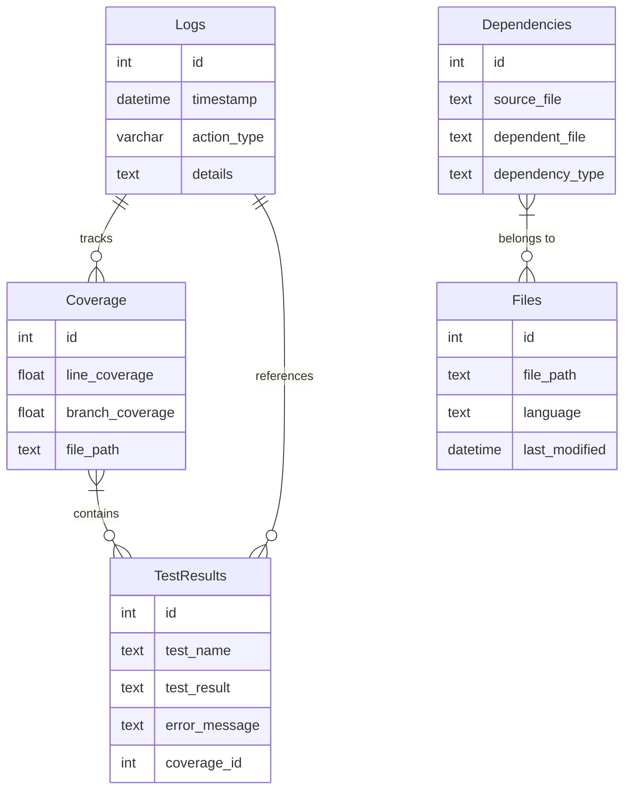

# PROJECT: MAFIA

## Core Functionalities Decomposition

### 1. Code Analysis & Understanding

**Category:** Core Development Tools

#### Feature Name: Codebase Analysis Tool

- **Key Components:**
  - `src/utils/EnhancedProjectScanner.ts`
  - `src/analysis/ArchitectureValidator.ts`
- **Considerations:**
  - Parse directory structures recursively.
  - Generate Mermaid.js diagrams for architecture.
  - Error handling for invalid paths.
- **Purpose & Benefits:**
  - Analyze complex codebases via structure and content scanning.
- **User Interactions:**
  - Users input directory paths to scan; view dependency maps and architecture diagrams.
- **Technical Specifications:**
  - Responsive dashboard with collapsible file trees and embedded Mermaid visualizations.

#### Feature Name: Language Understanding Module

- **Key Components:**
  - `src/ai/LanguageDetector.ts`
  - `src/analysis/CodeParser.ts`
- **Considerations:**
  - Use AST parsing for syntax.
  - Maintain language-specific regex patterns.
  - Cache results for performance.
- **Purpose & Benefits:**
  - Support all major languages (TypeScript/JavaScript, Python, Java) for analysis.
- **User Interactions:**
  - Users select files to analyze syntax and patterns.
- **Technical Specifications:**
  - Clean syntax highlighting using Tailwind color utilities and monospace fonts.

#### Feature Name: Dependency Tracing Module

- **Key Components:**
  - `src/views/DependencyGraph.ts`
  - `src/analysis/DependencyMapper.ts`
- **Considerations:**
  - Traverse import/export statements.
  - Build dependency trees with recursion.
  - Handle circular dependencies gracefully.
- **Purpose & Benefits:**
  - Visualize dependencies between files and modules.
- **User Interactions:**
  - Users click nodes in dependency graphs to see file relationships.
- **Technical Specifications:**
  - Interactive graph using D3.js with hover effects and Tailwind-styled nodes/edges.

### 2. Code Modification & Enhancement

**Category:** Development Workflow

#### Feature Name: Diff-Based Editor

- **Key Components:**
  - `src/ai/CodeModifier.ts`
  - `src/views/CodeEditor.ts`
- **Considerations:**
  - Parse unified diff format.
  - Validate diffs against current file state.
  - Undo/redo functionality.
- **Purpose & Benefits:**
  - Apply precise code changes via diff patches.
- **User Interactions:**
  - Users upload diffs or edit files directly in a Monaco Editor-like interface.
- **Technical Specifications:**
  - Tailwind-styled UI, syntax highlighting, and diff markers.

#### Feature Name: File Creation Wizard

- **Key Components:**
  - `src/templates/file_templates.ts`
  - `src/export/CodeGenerator.ts`
- **Considerations:**
  - Use Handlebars templates.
  - Validate template parameters.
  - Auto-add to project structure.
- **Purpose & Benefits:**
  - Generate complete files with best practices (e.g., TypeScript interfaces).
- **User Interactions:**
  - Users fill templates with metadata; auto-generate boilerplate code.
- **Technical Specifications:**
  - Form-based interface with input validation and live previews using Tailwind forms.

#### Feature Name: Architecture Refactoring Tool

- **Key Components:**
  - `src/views/ProjectLayout.ts`
  - `src/analysis/RefactorEngine.ts`
- **Considerations:**
  - Track file dependencies.
  - Preview changes before execution.
  - Atomic commits.
- **Purpose & Benefits:**
  - Reorganize project structures while maintaining functionality.
- **User Interactions:**
  - Users drag-and-drop files/modules in a visual layout editor.
- **Technical Specifications:**
  - Drag-and-drop interface with grid layout and real-time preview using Tailwind grid.

### 3. Tool Integration

**Category:** Development Environment

#### Feature Name: Build Configuration Editor

- **Key Components:**
  - `src/templates/config_templates.ts`
  - `src/export/ConfigGenerator.ts`
- **Considerations:**
  - Parse JSON/YAML config files.
  - Validate schema compliance.
  - Auto-save changes.
- **Purpose & Benefits:**
  - Manage Webpack/Jest configurations via UI.
- **User Interactions:**
  - Users toggle settings (e.g., minification, test coverage) in a form.
- **Technical Specifications:**
  - Form with collapsible sections, syntax highlighting for config snippets, and save buttons styled with Tailwind.

#### Feature Name: Extension Dependency Manager

- **Key Components:**
  - `src/views/ExtensionList.ts`
  - `src/commands/ExtensionManager.ts`
- **Considerations:**
  - Query VS Code Marketplace API.
  - Validate compatibility.
  - Batch install/uninstall.
- **Purpose & Benefits:**
  - Install/upgrade VS Code dependencies via UI.
- **User Interactions:**
  - Users search for extensions and manage versions.
- **Technical Specifications:**
  - Searchable list with version badges, progress bars, and Tailwind-styled cards.

### 4. Testing & Quality Assurance

**Category:** Development Validation

#### Feature Name: Test Framework Enhancer

- **Key Components:**
  - `src/views/TestCoverage.ts`
  - `src/commands/TestRunner.ts`
- **Considerations:**
  - Integrate Jest CLI.
  - Generate LCOV reports.
  - Handle parallel test runs.
- **Purpose & Benefits:**
  - Extend Jest with custom reporters and coverage visualization.
- **User Interactions:**
  - Users configure test suites and view coverage heatmaps.
- **Technical Specifications:**
  - Heatmap visualization with color gradients and responsive tables styled with Tailwind.

#### Feature Name: Test Generator

- **Key Components:**
  - `src/ai/TestGenerator.ts`
  - `src/views/TestPreview.ts`
- **Considerations:**
  - Use AI to infer test scenarios.
  - Validate test syntax.
  - Auto-run tests.
- **Purpose & Benefits:**
  - Auto-generate Jest tests from code snippets.
- **User Interactions:**
  - Users paste code and select test cases; generated tests appear in a preview pane.
- **Technical Specifications:**
  - Split-pane interface with Monaco Editor for code input and Tailwind-styled test results.

### 5. Documentation

**Category:** Knowledge Management

#### Feature Name: Auto-Documentation Tool

- **Key Components:**
  - `src/templates/doc_templates.ts`
  - `src/export/DocumentationExporter.ts`
- **Considerations:**
  - Parse JSDoc/TypeDoc comments.
  - Auto-generate API references.
  - Validate doc consistency.
- **Purpose & Benefits:**
  - Generate Markdown docs from code comments and structure.
- **User Interactions:**
  - Users select files to document, preview and export to .md files.
- **Technical Specifications:**
  - Preview pane with live updates, export buttons, and Tailwind-styled documentation cards.

#### Feature Name: Changelog Manager

- **Key Components:**
  - `src/views/ChangelogViewer.ts`
  - `src/commands/ChangelogGenerator.ts`
- **Considerations:**
  - Parse Git commit messages.
  - Group by semantic versioning.
  - Export to .md.
- **Purpose & Benefits:**
  - Track version history and auto-generate changelogs from Git commits.
- **User Interactions:**
  - Users filter commits by version and view formatted changelogs.
- **Technical Specifications:**
  - Timeline view with version tags and collapsible commit details using Tailwind animations.

### 6. Project-Specific Capabilities

**Category:** MAFIA Extension Features

#### Feature Name: AI Service Enhancer

- **Key Components:**
  - `src/ai/AIServiceV2.ts`
  - `src/views/AIAssistantView.tsx`
- **Considerations:**
  - WebSocket for streaming.
  - Rate limiting.
  - Error logging to SQLite.
- **Purpose & Benefits:**
  - Improve AIServiceV2 with real-time suggestions and operation monitoring.
- **User Interactions:**
  - Users input prompts in a sidebar, see suggestions and execution status in real-time.
- **Technical Specifications:**
  - Sidebar with input field, suggestion cards, and a status bar using Tailwind flex utilities.

#### Feature Name: Dependency Mapper UI

- **Key Components:**
  - `src/views/DependencyMap.ts`
  - `src/analysis/DependencyMapper.ts`
- **Considerations:**
  - Build dependency graph from AST.
  - Handle large projects with pagination.
  - Export graphs.
- **Purpose & Benefits:**
  - Visualize project dependencies in the VS Code webview.
- **User Interactions:**
  - Users click nodes to see dependency paths; filter by module.
- **Technical Specifications:**
  - Interactive graph with hover tooltips and Tailwind-styled buttons for filtering.

#### Feature Name: Quality Dashboard

- **Key Components:**
  - `src/views/QualityDashboard.ts`
  - `src/analysis/QualityMetrics.ts`
- **Considerations:**
  - Integrate ESLint/TS lint.
  - Calculate cyclomatic complexity.
  - Auto-refresh on save.
- **Purpose & Benefits:**
  - Display code quality metrics (coverage, linting, complexity).
- **User Interactions:**
  - Users view metrics in a dashboard; drill down into problematic files.
- **Technical Specifications:**
  - Card-based layout with progress bars and color-coded statuses using Tailwind gradients.

## Design & Usability Guidelines

### Frontend Implementation Plan

#### Base Structure

- Use `<script src="https://cdn.tailwindcss.com"></script>` for Tailwind.
- Import Google Font: `<link href="https://fonts.googleapis.com/css2?family=Inter:wght@400;500;700&display=swap" rel="stylesheet">`.
- Base layout uses Tailwind's container and grid utilities for responsiveness.

#### UI Components

- **Headers:** `bg-gray-100 p-4 text-2xl font-bold` with Inter font.
- **Cards:** `bg-white shadow-md rounded-lg p-4 border border-gray-200` for modals and panels.
- **Buttons:** `px-4 py-2 rounded-md font-medium transition-colors` with hover effects.
- **Forms:** Use `flex` and `space-x-2` for input groups.

#### Responsive Design

- **Mobile breakpoint:** `@media (max-width: 768px)` collapses grids into vertical stacks.
- Use `w-full` for inputs and `flex-col` layouts on smaller screens.

#### Accessibility

- `aria-label` for all interactive elements.
- High contrast mode toggle using Tailwind's `dark:` variants.
- Screen reader-friendly labels and error messages.

### Single System Architecture Alignment

- Central `ExtensionMain.ts` coordinates all features.
- Event-driven communication via VS Code's `vscode.postMessage`.
- Shared state via `workspace.getConfiguration` for settings and preferences.

### Implementation Plan

#### Code Analysis & Understanding

- Develop `EnhancedProjectScanner.ts` to recursively parse directories.
- Integrate Mermaid.js for architecture diagrams in `src/views/ArchitectureViewer.ts`.
- Add error handling for invalid paths in `src/analysis/ArchitectureValidator.ts`.

#### Code Modification

- Implement diff parsing in `CodeModifier.ts` using diff library.
- Build Monaco Editor integration in `CodeEditor.ts` with Tailwind styling.

#### Testing Framework

- Create Jest reporter in `TestRunner.ts` to generate LCOV reports.
- Design `TestCoverage.ts` to visualize coverage with color-coded heatmaps.

#### Documentation

- Auto-generate docs from JSDoc in `DocumentationExporter.ts`.
- Build `ChangelogViewer.ts` to parse Git commits and format into cards.

#### Project-Specific Features

- Enhance `AIServiceV2.ts` with WebSocket streaming and rate limiting.
- Build `QualityDashboard.ts` to aggregate ESLint/TS lint results.

## Project File Structure

```
MAFIA/
├── docs/
│   ├── CODE_ANALYSIS.md
│   ├── MODIFICATION_GUIDE.md
│   ├── TOOLS_REFERENCE.md
│   └── QUALITY_ASSURANCE.md
├── src/
│   ├── ai/
│   │   ├── CodeModifier.ts
│   │   ├── CodeParser.ts
│   │   ├── LanguageDetector.ts
│   │   └── TestGenerator.ts
│   ├── analysis/
│   │   ├── EnhancedProjectScanner.ts
│   │   ├── ArchitectureValidator.ts
│   │   └── DependencyMapper.ts
│   ├── export/
│   │   ├── CodeGenerator.ts
│   │   ├── DocumentationExporter.ts
│   │   └── ConfigGenerator.ts
│   ├── commands/
│   │   ├── TestRunner.ts
│   │   ├── ChangelogGenerator.ts
│   │   └── ExtensionManager.ts
│   ├── views/
│   │   ├── CodeEditor.tsx
│   │   ├── DependencyGraph.tsx
│   │   ├── TestCoverage.tsx
│   │   ├── QualityDashboard.tsx
│   │   └── AIAssistantView.tsx
│   ├── templates/
│   │   ├── file_templates.ts
│   │   └── config_templates.ts
│   └── utils/
│       ├── DiffParser.ts
│       └── SQLiteLogger.ts
├── webview-ui/
│   ├── index.html
│   ├── dashboard.html
│   └── documentation.html
├── package.json
├── sqlite.db
└── jest.config.js
```

## File Level Details

### 1. src/analysis/EnhancedProjectScanner.ts

**Purpose:** Scan directories to analyze project structure and dependencies.

- **Functionalities/Responsibilities:**
  - Recursively parse directories and files.
  - Generate Mermaid.js architecture diagrams.
  - Validate directory paths and handle errors.
- **Implementation Details:**
  - Use Node.js `fs` module for file system operations.
  - Build Mermaid syntax strings dynamically based on file relationships.
  - Error handling for invalid paths using `try-catch`.
- **Technical Considerations:**
  - Optimize for large projects with pagination.
  - Cache scan results to avoid redundant processing.
- **Dependencies:**
  - `ArchitectureValidator.ts` (validates diagram syntax).
  - `DependencyMapper.ts` (tracks dependencies).

### 2. src/ai/CodeParser.ts

**Purpose:** Parse code syntax for analysis across languages.

- **Functionalities/Responsibilities:**
  - Detect language type (TypeScript, Python, Java).
  - Extract syntax trees (AST) for dependency tracing.
  - Identify function/class definitions and imports.
- **Implementation Details:**
  - Use `@typescript-eslint/parser` for TypeScript AST.
  - Regular expressions for non-AST languages (e.g., Python).
  - Maintain a registry of language-specific parsers.
- **Technical Considerations:**
  - Handle edge cases like minified code.
  - Support for multi-language projects.
- **Dependencies:**
  - `LanguageDetector.ts` (determines file type).
  - `DependencyMapper.ts` (processes AST imports).

### 3. src/export/CodeGenerator.ts

**Purpose:** Generate boilerplate code from templates.

- **Functionalities/Responsibilities:**
  - Render Handlebars templates with user inputs.
  - Validate template parameters (e.g., class names).
  - Auto-add generated files to project structure.
- **Implementation Details:**
  - Use handlebars library for template rendering.
  - Validate inputs against schema (e.g., `@Validate('className')`).
  - Write files using `fs.writeFileSync`.
- **Technical Considerations:**
  - Prevent overwriting existing files.
  - Maintain template consistency across languages.
- **Dependencies:**
  - `file_templates.ts` (stores template strings).
  - `CodeModifier.ts` (applies diffs if needed).

### 4. src/views/CodeEditor.tsx

**Purpose:** Provide a Monaco Editor-like interface for code editing.

- **Functionalities/Responsibilities:**
  - Display files with syntax highlighting.
  - Apply diffs via `CodeModifier.ts`.
  - Show real-time validation errors.
- **Implementation Details:**
  - Integrate Monaco Editor via CDN.
  - Use `DiffParser.ts` to highlight changes.
  - Bind keyboard shortcuts (e.g., `Ctrl+S` to save).
- **Technical Considerations:**
  - Optimize performance for large files.
  - Sync with backend for real-time collaboration.
- **Dependencies:**
  - `CodeModifier.ts` (applies diffs).
  - `SQLiteLogger.ts` (logs edits).

### 5. src/commands/TestRunner.ts

**Purpose:** Execute Jest tests and generate coverage reports.

- **Functionalities/Responsibilities:**
  - Run Jest CLI commands.
  - Parse LCOV coverage data.
  - Display results in `TestCoverage.tsx`.
- **Implementation Details:**
  - Use `child_process.exec` to run Jest.
  - Parse coverage `lcov.info` for line coverage.
  - Handle parallel test execution.
- **Technical Considerations:**
  - Avoid blocking UI during long runs.
  - Cache coverage data for quick reloads.
- **Dependencies:**
  - `TestGenerator.ts` (auto-generate tests).
  - `jest.config.js` (configuration).

### 6. src/views/QualityDashboard.tsx

**Purpose:** Display code quality metrics (coverage, linting).

- **Functionalities/Responsibilities:**
  - Aggregate ESLint/TS lint results.
  - Show cyclomatic complexity scores.
  - Allow filtering by file or module.
- **Implementation Details:**
  - Use `axios` to fetch ESLint reports.
  - Render charts with `react-chartjs-2`.
  - Highlight problematic files in a sortable table.
- **Technical Considerations:**
  - Real-time updates on file saves.
  - Responsive layout for mobile views.
- **Dependencies:**
  - `QualityMetrics.ts` (calculates scores).
  - `DependencyMapper.ts` (dependency context).


### 7. src/ai/AIServiceV2.ts

**Purpose:** Core AI service for real-time suggestions.

- **Functionalities/Responsibilities:**
  - Stream responses via WebSocket.
  - Rate-limit API calls to prevent abuse.
  - Log interactions to `sqlite.db`.
- **Implementation Details:**
  - Use `ws` library for WebSocket streaming.
  - Implement exponential backoff for rate limits.
  - Store logs in SQLite using `SQLiteLogger.ts`.
- **Technical Considerations:**
  - Graceful degradation if API is unavailable.
  - Secure API key storage in VS Code settings.
- **Dependencies:**
  - `SQLiteLogger.ts` (logging).
  - `PermissionService.ts` (user consent).

### 8. webview-ui/dashboard.html

**Purpose:** Main UI for code analysis and tools.

- **Functionalities/Responsibilities:**
  - Display dependency graphs and quality metrics.
  - Integrate with Monaco Editor for code editing.
  - Show real-time AI suggestions.
- **Implementation Details:**
  - Use Tailwind CDN for styling.
  - Import Google Font (Inter) for typography.
  - Embed React components via `dangerouslySetInnerHTML`.
- **Technical Considerations:**
  - Avoid CORS by using CDN resources.
  - Responsive design with Tailwind breakpoints.
- **Dependencies:**
  - `CodeEditor.tsx`, `DependencyGraph.tsx`, `AIAssistantView.tsx`.

### Additional Technical Considerations

1. **Database:**
   - Use SQLite3 for logging (`sqlite.db`).
   - Tables: Logs (interactions), coverage (test metrics).
   - Avoid `better-sqlite3` and use `sqlite3` package.

2. **Frontend:**
   - Multi-page architecture: `index.html` (home), `dashboard.html`, `documentation.html`.
   - Use Tailwind CDN: `<script src="https://cdn.tailwindcss.com"></script>`.
   - Images: Reference Pexels URLs (e.g., ``).

3. **Security:**
   - Sanitize inputs in `CodeModifier.ts` to prevent injection.
   - Encrypt API keys in VS Code settings.

4. **Performance:**
   - Debounce file scans in `EnhancedProjectScanner.ts`.
   - Lazy-load large dependency graphs.

5. **Testing:**
   - Jest tests for core modules (tests directory).
   - Mock AI responses in `AIServiceV2.test.ts`.

### Frontend vs. Backend Split

- **Frontend:**
  - All UI components (`*.tsx` files).
  - Webview HTML/CSS/JS (`webview-ui/`).
  - Dependency on Tailwind CDN and Google Fonts.

- **Backend:**
  - Core logic (`src/ai/`, `src/analysis/`, `src/export/`).
  - CLI commands (`src/commands/`).
  - SQLite interactions (`SQLiteLogger.ts`).

This plan ensures all features are implemented with clear technical specifications, adhering to the product design and avoiding CORS/dependency issues.

### Mermaid Syntax

**Sequence Diagram (Mermaid Syntax):**



### Entity Relationship Diagram (ERD) and API Endpoint Specifications

**Entity Relationship Diagram (ERD):**



**API Endpoint Specifications:**

1. **Code Analysis Endpoints**

| Endpoint        | Method | Purpose                                         | Parameters                       |
|-----------------|--------|-------------------------------------------------|----------------------------------|
| /analyze/project | POST   | Scan project directory and return architecture diagram | directoryPath: string            |
| /analyze/file   | GET    | Analyze syntax and structure of a specific file | filePath: string, language: string, dependencies: Dependency[] |

2. **Code Modification Endpoints**

| Endpoint       | Method | Purpose                                         | Parameters                       |
|----------------|--------|-------------------------------------------------|----------------------------------|
| /generate/file | POST   | Generate boilerplate code from templates        | templateName: string, params: object |
| /modify/diff   | PUT    | Apply a diff patch to a file                    | filePath: string, diff: boolean, newContent: string |

3. **Testing & Quality Endpoints**

| Endpoint        | Method | Purpose                                         | Parameters                       |
|-----------------|--------|-------------------------------------------------|----------------------------------|
| /test/run       | POST   | Execute Jest tests and return coverage          | testPattern: string              |
| /coverage/report | GET   | Fetch latest coverage data for a file          | filePath: string, lineNumber: number, searchCoverage: number |

4. **AI Service Endpoints**

| Endpoint         | Method | Purpose                                         | Parameters                       |
|------------------|--------|-------------------------------------------------|----------------------------------|
| /ai/suggest      | POST   | Get real-time code suggestions                  | prompt: string, context: string, suggestions: string[], confidence: number |
| /ai/generateTests | POST  | Auto-generate Jest tests from code snippet      | codeSnippet: string, tests: string, valid: boolean |

5. **Database Management Endpoints**

| Endpoint           | Method | Purpose                                         | Parameters                       |
|--------------------|--------|-------------------------------------------------|----------------------------------|
| /logs/save         | POST   | Log user interactions                           | action: string, details: string, logId: int |
| /dependencies/list | GET    | Fetch dependency relationships for a file       | filePath: string, dependencies: Dependency[] |

### Key Technical Notes

1. **WebSocket for AI Streaming**
   - Address: `ws://localhost:3000/ai/stream` for real-time suggestions.
   - Message Format: `{ type: "suggestion", data: { code: string, confidence: number } }`

2. **SQLite Schema**

```sql
CREATE TABLE logs (
  id INTEGER PRIMARY KEY,
  timestamp DATETIME,
  action_type VARCHAR,
  details TEXT
);

CREATE TABLE coverage (
  id INTEGER PRIMARY KEY,
  line_coverage FLOAT,
  branch_coverage FLOAT,
  file_path TEXT
);

CREATE TABLE dependencies (
  id INTEGER PRIMARY KEY,
  source_file TEXT,
  dependent_file TEXT,
  dependency_type TEXT
);

CREATE TABLE test_results (
  id INTEGER PRIMARY KEY,
  test_name TEXT,
  test_result TEXT,
  error_message TEXT,
  coverage_id INTEGER,
  FOREIGN KEY (coverage_id) REFERENCES coverage (id)
);

CREATE TABLE files (
  id INTEGER PRIMARY KEY,
  file_path TEXT,
  language TEXT,
  last_modified DATETIME
);
